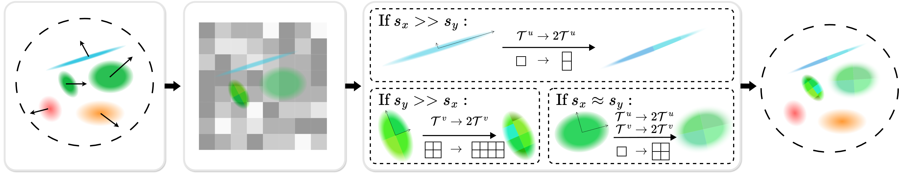

<h1 align="center"> A²TG: Adaptive Anisotropic Textured Gaussians for Efficient 3D Scene Representation</h1>
<p align="center"><b>ICLR 2026</b></p>
<p align="center">
  <a href="https://arxiv.org/abs/2601.09243" target="_blank">Paper</a>
</p>
<!-- <p align="center"><a href="" target="_blank">Project Page</a> |  -->


<p align="center">
<a href="https://rickyeeeeee.github.io/" target="_blank">Sheng-Chi Hsu, </a>
Ting-Yu Yen, 
<a href="https://scholar.google.com.tw/citations?user=zNpxBWUAAAAJ&hl=zh-TW&oi=ao" target="_blank">Shih-Hsuan Hung, </a>
<a href="https://cgv.cs.nthu.edu.tw/hkchu/" target="_blank">Hung-Kuo Chu </a>


<p align="center">National Tsing Hua University</p>




## Setup
The code was tested on:
- **OS**: Ubuntu 22.04.5 LTS
- **GPU**: NVIDIA RTX 5090
- **Driver Version**: 580.95.05 
- **CUDA Version**: 13.0
- **nvcc**: 12.8
- **Python Version**: 3.12.12
- **Torch Version**: 2.7.1+cu128

### 1. Install Necessary Packages
- Install Git.
- Install CUDA toolkit. (12.8 for example)

### 2. Install the Python Environment
Run in terminal:
```bash
git clone https://github.com/Rickyeeeeee/A2TG.git
cd A2TG
conda env create -f environment.yml
conda activate a2tg
python -m pip install --no-build-isolation -e . 
cd examples
python -m pip install -r requirements.txt --no-build-isolation
```
If `conda env create -f environment.yml` doesn't work, create the environment manually:
```bash
git clone https://github.com/Rickyeeeeee/A2TG.git
cd A2TG
conda create -n a2tg -y python=3.12
conda activate a2tg
pip install ninja
pip install setuptools==69.5.1
pip install torch==2.7.1 torchvision==0.22.1 torchaudio==2.7.1 --index-url https://download.pytorch.org/whl/cu128
python -m pip install --no-build-isolation -e .
cd examples
python -m pip install -r requirements.txt --no-build-isolation
```
(Other combinations of torch and cuda also work.)


## Dataset
- You can download the NeRF synthetic dataset [here](https://drive.google.com/file/d/1OsiBs2udl32-1CqTXCitmov4NQCYdA9g/view?usp=share_link) and the Mip-NeRF 360 dataset [here](https://jonbarron.info/mipnerf360/).
- Custom data loaders that support NeRF synthetic dataset and COLMAP dataset formats are defined in `examples/datasets/`. You can easily extend the code to support your own dataset. 

## Optimization
A $\text{A}^2\text{TG}$ scene is trained in a two steps manner, first train a 2D Gaussian Splatting model for 30000 iterations, than train $\text{A}^2\text{TG}$ with the same number of Gaussians for another 30000 iterations.

The adaptive anisotropic textures in $\text{A}^2\text{TG}$ is controlled by the texture upscaling strategy. The max texture resolution is two to the power of texture upscales, since every texture upscale double the texture resolutions of the selected Gaussians. That can be controlled by the arguments of `trainer.py`: 

> floor((`upscale_stop_iter`-`upscale_stop_iter`)/`upscale_every`)

Note: DATA_FACTOR for each dataset can be found in `fixed_mem_full_eval.py` or `fixed_pc_full_eval.py`.

```bash
# 1) 2DGS pre-training
python trainer.py mcmc \
  --max_steps 30000 \
  --eval_steps 30000 \
  --save_steps 30000 \
  --data_dir SCENE_DIR \
  --result_dir RESULT_DIR_2DGS \
  --init_extent 1 \
  --init_type sfm \
  --model_type=2dgs \
  --dataset colmap \
  --init_num_pts MAX_GAUSSIANS \ # Number of Gaussians
  --strategy.cap-max MAX_GAUSSIANS \ # Number of Gaussians
  --port 6070 \
  --disable_viewer \
  --data_factor DATA_FACTOR \ # Image resolution
  --upscale_start_iter 100000000
```
The following trainer produce maximun $4\times4$ texture resolution.
```bash
# 2) A2TG refinement from 2DGS checkpoint
python trainer.py mcmc \
  --data_dir SCENE_DIR \
  --pretrained_path CKPT_2DGS \
  --result_dir RESULT_DIR_A2TG \
  --eval_steps 30000 \
  --save_steps 30000 \
  --init_type pretrained \
  --model_type=a2tg \
  --dataset colmap \
  --init_num_pts POINT_COUNT \ # Number of Gaussians
  --strategy.cap-max POINT_COUNT \ # Number of Gaussians
  --port 6070 \
  --disable_viewer \
  --data_factor DATA_FACTOR \ # Image resolution
  --strategy.refine-start-iter=1000000000000 \
  --textured_rgb \ # Enable RGB texture 
  --textured_alpha \ # Enable Alpha texture
  --texture_resolution 1 \ # Texture initial resolution
  --min_aspect_ratio=4.0 \ # Axis ratio for aniostropic upscaling
  --max_scale_for_thin=0.01 \ # Don't anisotropic upscale if min axis is great than this
  --upscale_grad2d=0.00002 \
  --upscale_start_iter=0 \
  --upscale_stop_iter=1002 \ #Max texture resolution = 4
  --upscale_every=500
```

Optional textured-gaussians refinement for comparisons:
```bash
python trainer.py mcmc \
  --data_dir SCENE_DIR \
  --pretrained_path CKPT_2DGS \
  --result_dir RESULT_DIR_TG \
  --dataset colmap \
  --init_type pretrained \
  --model_type=textured_gaussians \
  --dataset colmap \
  --init_num_pts POINT_COUNT \ # Number of Gaussians
  --strategy.cap-max POINT_COUNT \ # Number of Gaussians
  --port 6070 \
  --disable_viewer \
  --data_factor DATA_FACTOR \ # Image resolution
  --strategy.refine-start-iter=1000000000000 \
  --textured_rgb \
  --textured_alpha \
  --texture_resolution 4 \
  --upscale_start_iter=10000000 \ # No upscale
```

## Full Evaluation
The full evaluation scripts in `examples/` are the recommended way to reproduce training:

- `examples/fixed_pc_full_eval.py` (fixed point count evaluation)
- `examples/fixed_mem_full_eval.py` (fixed memory evaluation)

```bash
cd examples

# Fixed point-count full evaluation
python fixed_pc_full_eval.py \
  --db-dataset /path/to/db \
  --tandt-dataset /path/to/tandt \
  --mipnerf360-dataset /path/to/MipNerf360 \
  --output /path/to/output \
  --cuda-device-id 0

# Fixed-memory full evaluation
python fixed_mem_full_eval.py \
  --mem 200 \
  --db-dataset /path/to/db \
  --tandt-dataset /path/to/tandt \
  --mipnerf360-dataset /path/to/MipNerf360 \
  --output /path/to/output \
  --cuda-device-id 0 
```

## Viewer
Launch the viewer for a specific scene:
```Bash
python viewer.py \
  --model-type a2tg \ # a2tg or textured_gaussians or 2dgs
  --dataset none \
  --ckpt /path/to/ckpt
```
Launch the viewer for a specific scene with training&testing camera debugging:
```Bash
python viewer.py \
  --model-type a2tg \ # a2tg or textured_gaussians or 2dgs
  --dataset colmap \
  --data-dir SCENE_DIR \ # Dataset
  --data-factor DATA_FACTOR \
  --test-every 8 \
  --ckpt /path/to/ckpt 
```

## Acknowledgements
The codebase is built upon the following repositories:
- [textured-gaussians](https://github.com/bchao1/textured_gaussians)
- [gsplat](https://github.com/nerfstudio-project/gsplat)

Special thanks to the authors of these repositories for their open-source contributions, which greatly facilitated our research and development!

## License

This codebase is Apache 2.0 licensed. Please refer to the [LICENSE](LICENSE) file for more details.

## Citation
If you find our work useful, please cite:

```bibtex
@article{hsu20262,
  title={A $\^{} 2$ TG: Adaptive Anisotropic Textured Gaussians for Efficient 3D Scene Representation},
  author={Hsu, Sheng-Chi and Yen, Ting-Yu and Hung, Shih-Hsuan and Chu, Hung-Kuo},
  journal={arXiv preprint arXiv:2601.09243},
  year={2026}
}
```
